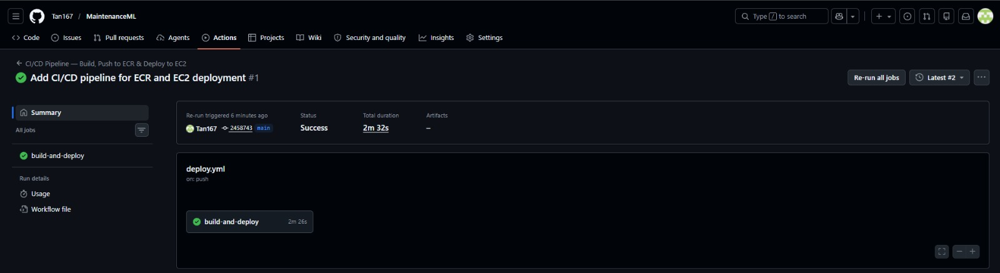

# MaintenanceML — Predictive Equipment Failure Detection

> End-to-end MLOps pipeline: automated CI/CD with GitHub Actions, containerized with Docker, deployed on AWS EC2 via Amazon ECR.

---

## CI/CD Pipeline — Live


*GitHub Actions — automated build, push to ECR, and deploy to EC2 on every commit*

---

## Live App


*Live on AWS EC2 — real-time equipment failure prediction*


*Health check endpoint confirming deployment*

---

## Architecture

```
GitHub Push → GitHub Actions CI/CD → Docker Build → Amazon ECR → AWS EC2 (live app)
                    │
                    ├── Build Docker image
                    ├── Push to Amazon ECR (latest + SHA tag)
                    └── SSH deploy to EC2 (zero-downtime container swap)
```

## Tech Stack

| Layer | Technology |
|---|---|
| ML Model | Scikit-learn, XGBoost |
| API | FastAPI, Uvicorn |
| Containerization | Docker, Docker Compose |
| CI/CD | GitHub Actions |
| Container Registry | Amazon ECR |
| Cloud Deployment | AWS EC2 (t2.micro) |

## CI/CD Pipeline

Every push to `main` automatically:

1. Builds a Docker image tagged with the commit SHA
2. Pushes both `:latest` and `:<sha>` tags to Amazon ECR
3. SSHs into EC2 and performs a zero-downtime container swap
4. Verifies the new container is running

No manual deployment steps required.

## Local Setup

```bash
git clone https://github.com/Tan167/MaintenanceML.git
cd MaintenanceML
docker compose up --build
# App at http://localhost:8080
# Health check at http://localhost:8080/health
```

## API Endpoints

| Endpoint | Method | Description |
|---|---|---|
| `/` | GET | Web UI |
| `/predict` | POST | Returns failure classification |
| `/health` | GET | Health check |

## ML Model

- Multiclass fault classification — No Failure, Heat Dissipation, Power, Overstrain, Tool Wear
- Trained on AI4I 2020 Predictive Maintenance Dataset
- Evaluated with Precision, Recall, F1-score across all fault classes
- Model artifacts stored in `artifacts/` directory
